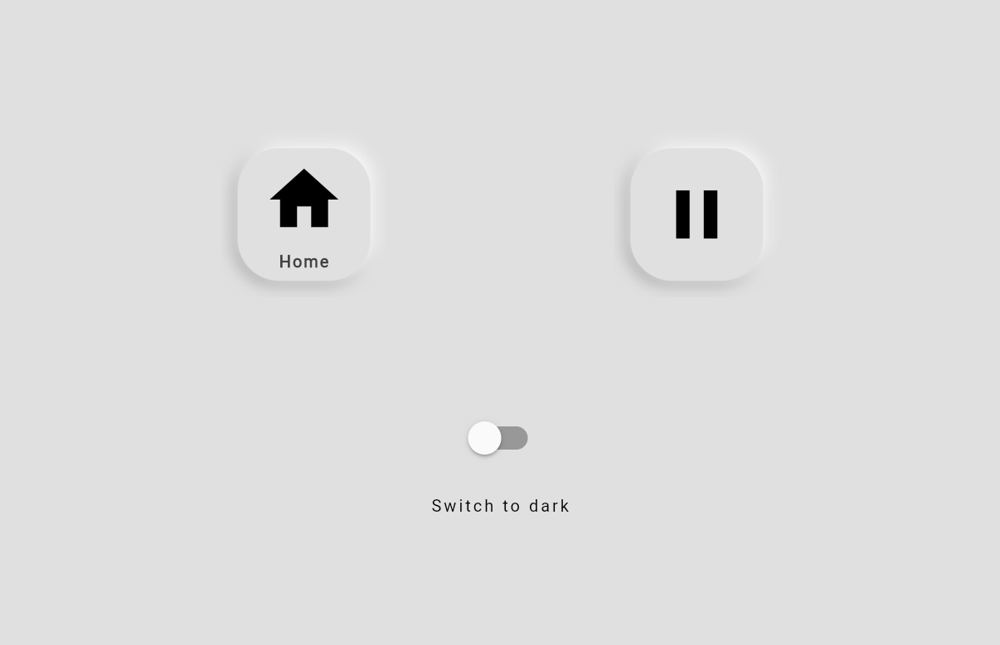
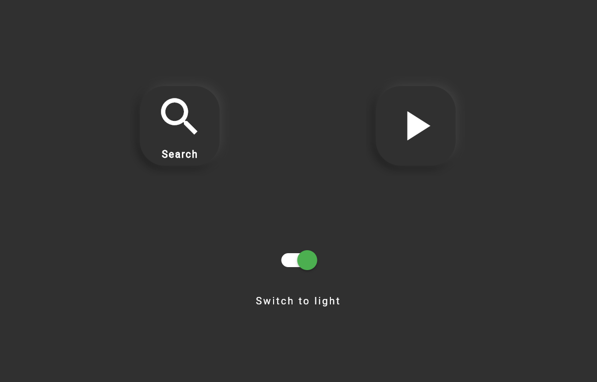
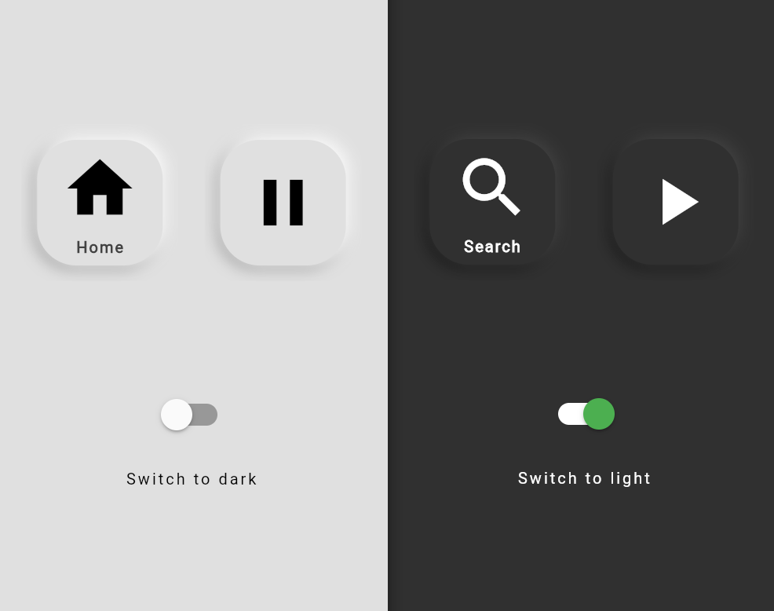

# Flutter Button Component

Flutter Reusable Button Component with Neumorphism Design


## Example Images








## Usage/Examples


#### Button Component Calling

```dart

     ButtonComponent(
                    props: new ButtonComponentProperties(
                        darkMode ? "FF303030" : "FFE0E0E0", child1(), darkMode),
                    onClick: () => {print("hello test")}),

```

#### Button Component Properties Class

```dart

class ButtonComponentProperties {
  final String _backgroundColor;
  final Widget _child;
  final bool _darkMode;

  ButtonComponentProperties(this._backgroundColor , this._child, this._darkMode);

  Widget get child => _child;

  bool get darkMode => _darkMode;

  String get backgroundColor => _backgroundColor;

}

```

#### Example child widget defination

```dart
  Widget child1() {
    return Column(
      mainAxisAlignment: MainAxisAlignment.spaceEvenly,
      children: [
        Icon(darkMode ? Icons.search : Icons.home,
            size: 100, color: darkMode ? Colors.white : Colors.black),
        Text(
          darkMode ? "Search" : "Home",
          style: TextStyle(
            fontSize: 20,
            letterSpacing: 2.0,
            fontWeight: FontWeight.bold,
            color: darkMode ? Colors.white : Colors.grey[800]!,
          ),
        )
      ],
    );
  }
```